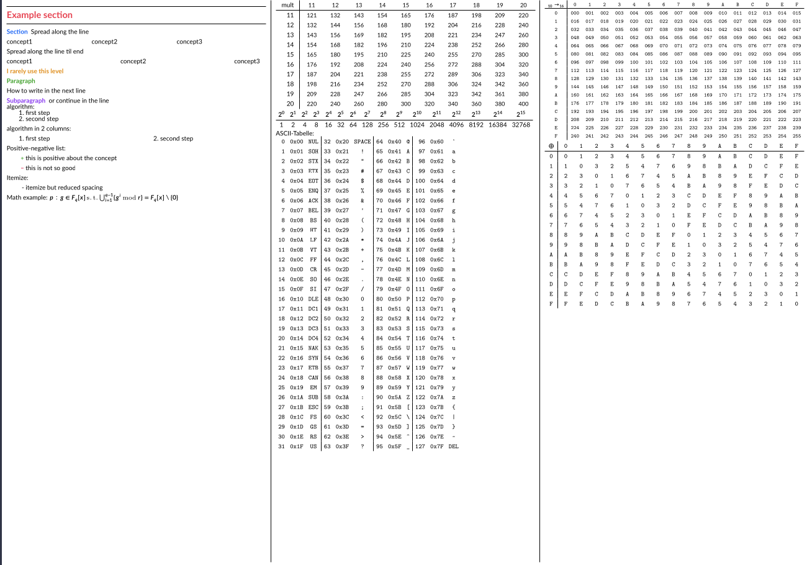

# cheatsheet_tmplate

A template for writing a condensed cheatsheet for e.g. exams.

By default the sheet will be landscape and have 3 columns (content is
automatically being distributed). You can change the columns in `main.tex`
(`condMulticols` argument) and the orientation in `main.sheet.tex`
(`KOMAoptions` -> `paper` option).



## Assumptions / prerequisites
This section briefely states some dependencies and some information about the
environment.

### Packages
#### catppuccinPalette (used, but can be easily replaced)
Some colors being used come from the
[`catppuccinPalette`](https://github.com/atticus-sullivan/catpuccinPalette)
package (not published on CTAN, thus not possible contained in a TeXlive
installation). You can either search for `Cat<color>` in `main.sheet.tex` and
replace the colors, or build `catpuccinPalette` (or download the `.sty` from the
current release) and place the resulting `.sty` in your tex path (or the project
root directory).

### TeX Engine
I personally am in favour of the LuaLaTeX engine and use it (almost
exclusively) but for the functionallity it's not necessary to do so. The lua
specific features from `utils.lua` (currently only auto generating some tables
and draw packet headers) won't be available with engines without support for
lua.

Just make sure to remove the `\directlua` calls from `main.tex`.

### Build Script
I'm using `cluttex` for building LaTeX documents which allows to place all
intermediate files cleanly into a directory (`tex-aux`) and not clutter the
project's directory (hence the name). This script should be included in newer
TeXLive installations but some features might be lacking (not used in the
template right now).

You're free to use other tools like `latexmk` but you might want to adjust the
`Makefile` accordingly.

## Getting started
- clone the repository
- check dependencies (handle issues)
- read through `preamble.tex`, most importantly the `NewDocumentCommand`
`DeclareMathOperator` `NewDocumentEnvironment` statements as using the provided
commands/environments might be useful when writing the content.
- strip `main.tex` of everything you don't need (you might not need all otr even
none of the generated tables)
- create a new section-file in `sections/` (or copy the `sections/example.tex`),
put your content there and add `\input{sections/<your section-file name>}` in
`main.tex` (as shown with `sections/example.tex`).
- Also feel free to tamper with the `preamble.tex` as you want to, remove
packets you don't need, add some etc. The ones contained there are more like a
suggestion what might be useful.

## Files
This section briefly goes over the files belonging to this template

### main.script.tex
Compile via this file to build in script mode (more on that later).

### main.sheet.tex
Compile via this file to build in cheatsheet mode (probably what you want when
you're using this template).

### preamble.tex
All (script/sheet independent) settings (loading packages and configuring them ,
defining macros/environments) are placed here.

### main.tex
Root file for the content.

### sections/
I'd recommend to place each section in a dedicated file (no preamble, just
`\section{new section}`) and include these files with
`\input{sections/<filename>}` in `main.tex` (see example with example section).
This makes handling the tex code much more easier since the files don't get that
large.

### utils.lua (only when compiling with LuaLaTeX)
Contains some useful lua functions for automatically generating tables and
packet haders. Have a look at the comment above the respective function (or the
examples in the `main.tex` file) for usage of the individual function.

## Notes on packets
### nicematrix
- you might want to use the `small` option for matrices or set
`\setlength{\arraycolsep}{2pt}` for more condensed matrices. If you want the
latter one only for the `bNiceMatrix` environment, use

```latex
\usepackage{etoolbox}
\AtBeginEnvironment{bNiceMatrix}{\setlength{\arraycolsep}{2pt}}
```
(Credits to Kristi)

## Collaboration
You're welcome so submit
[issues](https://github.com/atticus-sullivan/cheatsheet_tmpl/issuesissues)
and/or [PRs](https://github.com/atticus-sullivan/cheatsheet_tmpl/pulls). Also
feel free to chat about e.g. which packages (+options) you found helpful in the
[discussions](https://github.com/atticus-sullivan/cheatsheet_tmpl/discussions).
Especially if you decide on writing some more generating things with lua, I'd be
very much interested so feel free to share.


## Why is there a script mode / `main.script.tex`
The attempt is to be able to typeset the same content in a consensed form as
well as in a form more nice/natural to read (portrait, bigger font, only one
column etc).

To be honest I'm not using this very much on my own but it's there and you can
even have small variations in the content (e.g. if you want to use some
abbreviation on your cheatsheet to make a line fit one line in the output but
want the script to be better readable) by using `\ifscript{tex-code}` and/or
`\ifsheet{tex-code}`.
